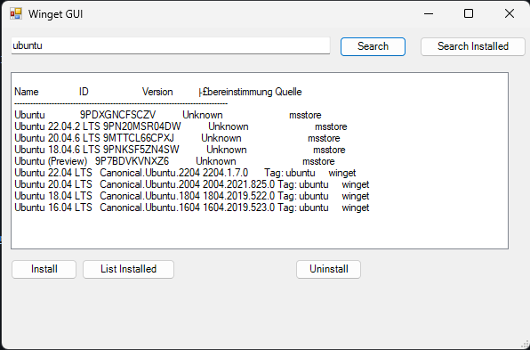

# Windows Package Manager (winget) GUI

This is a simple graphical user interface (GUI) for the Windows Package Manager, `winget`, written in PowerShell. The GUI allows you to search for apps, install and uninstall them, and list installed applications. It provides a more user-friendly way to interact with `winget` on your Windows system.

## How to Use

1. Clone or download this repository to your local machine.
2. Open a PowerShell terminal.
3. Navigate to the repository directory.
4. Run the `winget-gui.ps1` script.

### Features

- **Search for Apps**: Enter the name of the app you want to search for in the text box and click the "Search" button. The results will be displayed in the list box.

- **Install an App**: Select an app from the search results and click the "Install" button. This will install the selected app using `winget`.

- **Search Installed Apps**: Enter the name of an installed app in the text box and click the "Search Installed" button. The installed apps will be displayed in the list box.

- **List All Installed Apps**: Click the "List Installed" button to list all installed apps on your system.

- **Uninstall an App**: Select an installed app from the list and click the "Uninstall" button. This will uninstall the selected app using `winget`.

## Requirements

- Windows 10 or later with Windows Package Manager (`winget`) installed.

## License

This project is licensed under the MIT License - see the [LICENSE](LICENSE) file for details.

## Author

- [GHLIX](https://github.com/Pommmmmes)

## Acknowledgments

- [Winget Command Line Tool Documentation](https://docs.microsoft.com/en-us/windows/package-manager/winget/)

Enjoy using this simple `winget` GUI!

